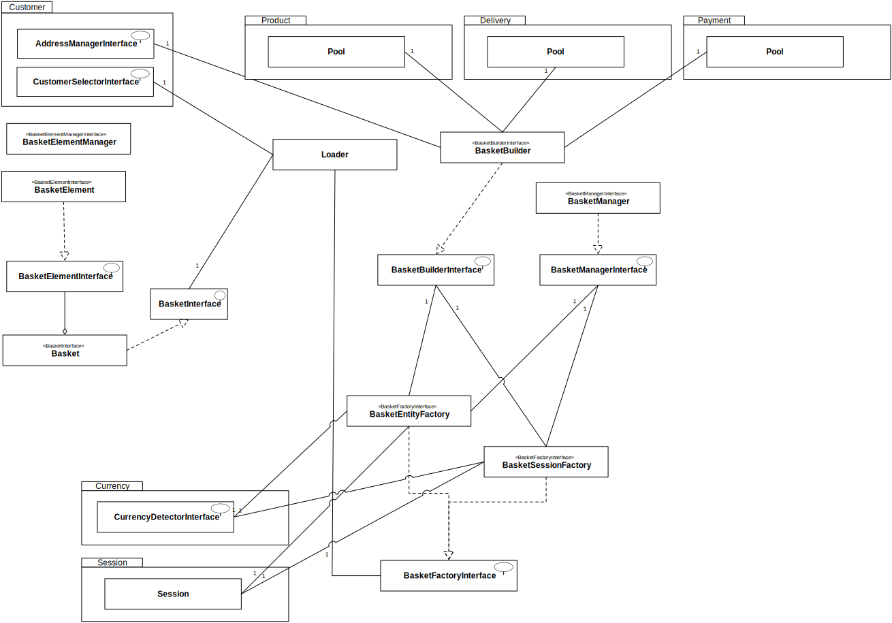
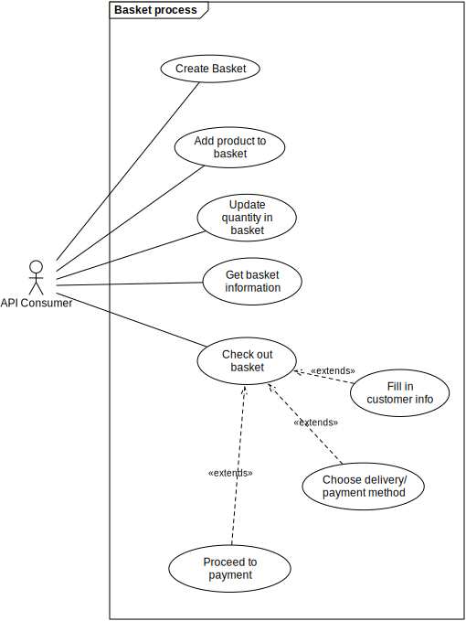
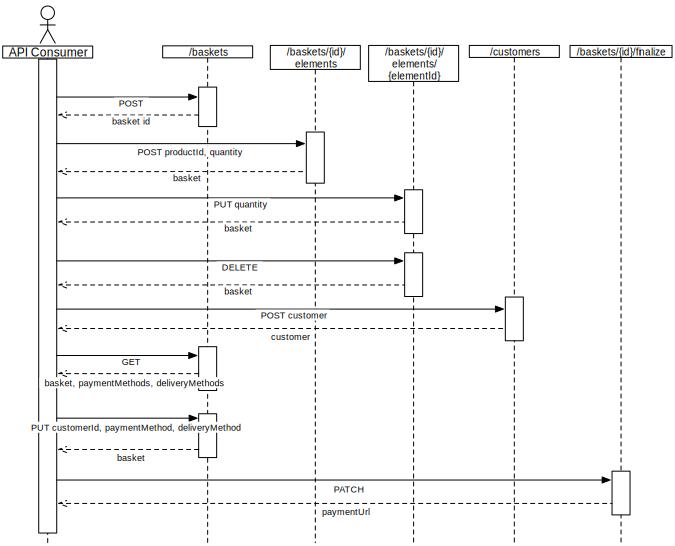

.. index::
   single: Basket
   pair: Basket; Architecture

======
Basket
======

Basket Class Diagram
--------------------

Click on the image to view a bigger version.

Basket API Consumer Schema
--------------------------

Here is how you can consume our Basket API:

Click on the image to view a bigger version.

Basket API Sequence Diagram
---------------------------

Here is a sequence diagram of different basket APIs you can use:

Click on the image to view a bigger version.