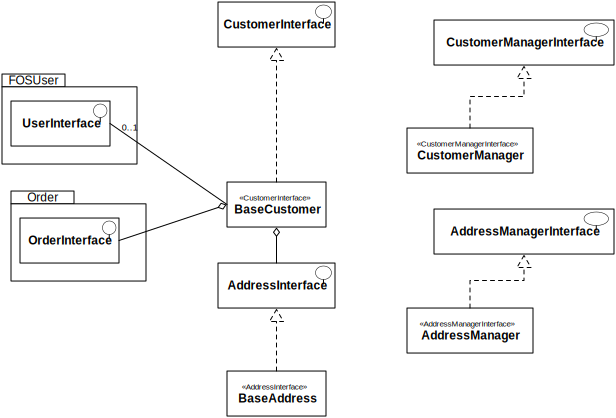

.. index::
    single: Customer

========
Customer
========

Click on the image to view a bigger version.

Customer Helpers
================

Some Twig helpers are available for your templates:

  - ``sonata_address_render(address, showName = true, showEditButton = false)`` displays a well-formatted address (needs an AdressInterface instance or an array as a parameter) ; if showName is set to true, the name of the address will be displayed if availbale ; if showEditButton is set to true and an address id is provided, an edit button will be rendered as well. This helper uses the template ``SonataCustomerBundle:Addresses:_address.html.twig`` to display the formatted address.

