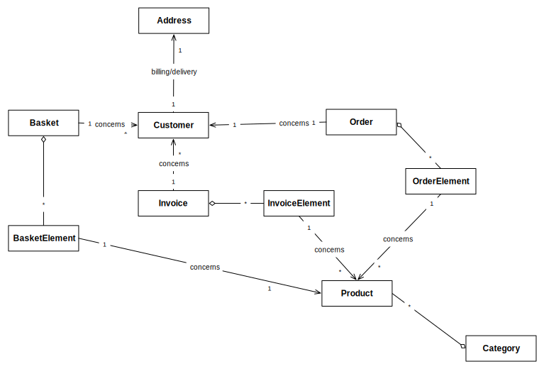
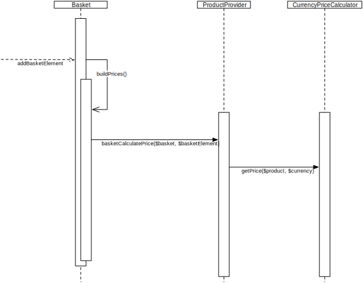

.. index::
    single: Class Diagram
    single: Order
    single: Payment
    single: Price
    single: Delivery
    single: Invoice
    single: Customer

==============================
Sonata e-commerce Architecture
==============================

Congratulations! You've successfully installed the e-commerce bundles of Sonata! Now, it's time to digg in. Here's an overview of the architecture of the library.

Below, you'll find a simple `Class Diagram`, representing the relationships between the different entities. Be warned however! Some of those aren't DB relations, as they shouldn't be (you'll get more details as you keep reading).

Technical Choices
=================

Entity Mappings
---------------

You might be surprised not to find entity mappings in the Doctrine configuration files. Those mappings are actually defined in each bundle's extensions, in order to enable the mapping files overrides. So if you're looking for them, feel free to check those files.

If you'd like to add relations to your entities, you may add them in your overridden mapping files.

Order process (customer workflow)
---------------------------------

Currently, the order process is implemented as follows:

- The `Customer` chooses a `Product`
- He adds it to the `Basket` (which can be stored either in a session or in a database. See :doc:`../bundles/basket` for more information about DB storage)
- The `Customer` proceeds to checkout
- And he is invited to complete his profile, Sonata provides two options for this:

    - The `Customer` creates an account/authenticate on the website (option setted up by default when you installed the Sonata framework)
    - Or he fills a list of information in a one-time `Order`. In that case, we store his information in the `Basket` and he needs to fill the form for each `Order` he will make.

- He selects his `Delivery` option

.. note::
    This option depends on its country, as you can see in :doc:`product`.

- He selects his `Payment` mode

.. note::
    The choices depend on the products in his `Basket`.

- He processes to `Payment`

.. note::
    There, the `Basket` is transformed into an `Order`. This implies that the data that concerns the `Basket` is serialized and duplicated into an `Order`.
    This process is made in case of the `Customer's` information and/or the `Product's` information change. If the `Order` has been checked out, it has to be fixed in time, hence the serialization.

- When the payment is completed, we edit an invoice, which can be printed out as a PDF or HTML file. The default behavior is HTML representation.

Product variations
------------------

Each product can be splitted into `sub-products`: we call them ``variations``. The main `Product` is then called ``master product``.

The ``master product`` is used to be displayed in search results, recent products listing and catalog. The variations are displayed on a product view page.

.. note::

    The default variation displayed on a product view page is the cheapest one.

Price computation
-----------------

Well... We're entering the depths of it, aren't we? To be crystal clear, we'll try to answer the basic questions:

**When?**
    Each time you add a `Product` (ie. `BasketElement`) to your `Basket`, the `BasketElement price` is calculated & the `Basket price` is calculated as well.

**Based on?**
    The `Price` is computed based on defined product prices, VAT if any, quantity, and currency.

**Who/How?**
    As you can see below, when the `BasketElements` of the `Basket` are altered (added/removed), the `buildPrices` method is called, which for each element will compute its price. To do that, we go through the `Product` provider of the `BasketElement's product` (which you can override easily in your implementation), and then through the `Currency price` calculator (whose default behavior is only to return the `Product's price`).

Basket <-> Order transformations and storage
--------------------------------------------

Along the checkout process, once the `Basket` has been validated by the `Customer` and is about to be paid for, we'll transform the `Basket` (which is submitted to change) into an `Order` (which will be fixed in time). Therefore, Basket & Order entities are quite similar, but we'll need to copy data from one to the other. We can't afford having relationships / dependencies that may evolve later in the `Order` entity, therefore we copy or serialize those.

Basket -> Order
~~~~~~~~~~~~~~~

At the `Order` instance construction depending on the `Basket`, we'll compute the final `Order price`, based on `BasketElements`, `Delivery`, etc. We use the ``BasketTransformer::transformIntoOrder`` method to do so. This will check the `Basket` validity and create an `Order` instance based on that.

You may, of course, override this transformer and the associated service (service id is ``sonata.payment.transformer.basket``).

Order -> Basket
~~~~~~~~~~~~~~~

You may need sometimes to rebuild a `Basket` from a previous `Order`. In order to do so, the ``OrderTransformer::transformIntoBasket`` method does the job. Based on the stored product id, you'll be able to rebuild a `Basket` with the potentially new information (if you changed your product) of your website.

You may, of course, override this transformer and the associated service (service id is ``sonata.payment.transformer.order``).

Order -> Invoice
~~~~~~~~~~~~~~~~

See :doc:`invoice`.

Going in depths
===============

.. toctree::
    :maxdepth: 2

    product
    currency
    customer
    basket
    order
    payment
    invoice
    api
    events
