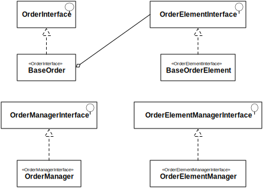

.. index::
    single: Order
    pair: Order; Architecture

=====
Order
=====

Click on the image to view a bigger version.

We tried to avoid as much relations as possible in the `Order`, so we would not be dependent of `Product` changes. (For instance, if you make an `Order` with a `Product` at a given `Price`, then the `Price` changes, you want to keep your old price in your `Order`). This is why the product is "serialized" in the order element (see the field ``rawProduct``).

The `Order's` locale is also set (to the `Basket` locale, which is set to the customer locale, which is set to the current locale on the customer's registration, but you may customize that in the ``BasketTransformer``). This locale is used to display the `Order`. More details in :doc:`index`.

Order Statuses
==============

An `Order` or an `OrderElement` may have the following statuses:

.. code-block:: php

    <?php

    // ...

    interface OrderInterface
    {
        const STATUS_OPEN       = 0; // created but not validated
        const STATUS_PENDING    = 1; // waiting from action from the user
        const STATUS_VALIDATED  = 2; // the order is validated does not mean the payment is ok
        const STATUS_CANCELLED  = 3; // the order is cancelled
        const STATUS_ERROR      = 4; // the order has an error
        const STATUS_STOPPED    = 5; // use if the subscription has been cancelled/stopped

        // ...
    }

Regarding the `Payment` statuses, here are the possible values:

.. code-block:: php

    <?php

    // ...

    interface TransactionInterface
    {
        const STATUS_ORDER_UNKNOWN    = -1; // the order is unknown
        const STATUS_OPEN             = 0;  // created but not validated
        const STATUS_PENDING          = 1;  // the bank send a 'pending-like' status, so the payment is not validated, but the user payed
        const STATUS_VALIDATED        = 2;  // the bank confirm the payment
        const STATUS_CANCELLED        = 3;  // the user cancelled the payment
        const STATUS_UNKNOWN          = 4;  // the bank sent a unknown code ...
        const STATUS_ERROR_VALIDATION = 9;  // something wrong happen when the bank validate the postback
        const STATUS_WRONG_CALLBACK   = 10; // something wrong is sent from the bank. hack or the bank change something ...
        const STATUS_WRONG_REQUEST    = 11; // the callback request is not valid
        const STATUS_ORDER_NOT_OPEN   = 12; // the order is not open (so a previous transaction already alter the order)

        // ...
    }

Finally, the values for the `Delivery` statuses:

.. code-block:: php

    <?php

    // ...

    interface ServiceDeliveryInterface
    {
        const STATUS_OPEN       = 1;    // Not processed yet
        const STATUS_PENDING    = 2;    // Packing
        const STATUS_SENT       = 3;    // In transit
        const STATUS_CANCELLED  = 4;    // Delivery cancelled
        const STATUS_COMPLETED  = 5;    // Delivered
        const STATUS_RETURNED   = 6;    // Returned to sender

        // ...
    }

Feel free to add your own statuses in your implementations; but remember to override the corresponding ``getStatusList`` static methods.