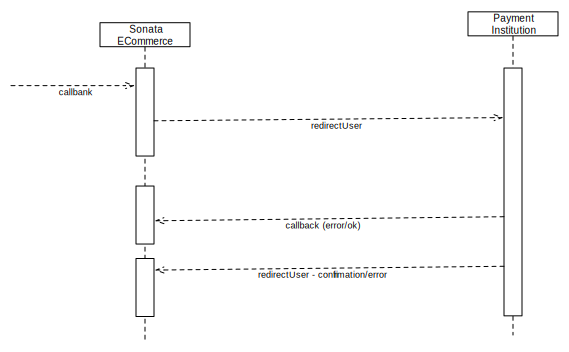

.. index::
    single: Payment
    pair: Payment; Architecture

=======
Payment
=======

`Payment` can be quite a complicated subject. One of our main goals was to provide a system that could interconnect with any payment institution (or be overridden to do so easily). The other one was, of course, security.

You'll find here the payment processes described, so you can understand them and be more comfortable with all of them when you'll digg in.

Interaction with payment institution
====================================

Regardless of the `Payment` method, the `Payment` process is as follows:

1. ``PaymentController::callbankAction``

Redirects the user to the payment institution (through the `Payment` method's callbank method)

2. Payment's return, the payment institution initiates a call to the ``PaymentController::callback`` action

This is a secured, server-to-server call; this is where we'll check the payment's return (depending on the payment institution's security policies), and update the order's status depending on the feedback given by the payment institution.

    - (Optionally) If everything is well, we send a request to the server to notify it that we did indeed handle its callback.
    - If the `Payment` method does not support this case, we simply update the application data and don't notify the server.

3. User's return

If the user didn't simply close the window, he's redirected to our website: this can be to the ``PaymentController::error`` action if there was an error, or he canceled; otherwise, if the `Payment` is successful, the user is redirected to the ``PaymentController::confirmation`` action which will only checks that the order's payment is indeed confirmed and displays a confirmation message to the user.

Data transformation during payment
==================================

- Before calling the payment institution:
    - The `Basket` is transformed into an `Order` via the `basketTransformer` linked to the `Payment` method chosen by the user and the `Order` is saved.
    - The `Basket` is resetted (ie. emptied - deleted from DB or cleaned from session) once the transformation is ended.
    - The status of the `Order` at this point is: ``OrderInterface::STATUS_OPEN``; its payment status is: ``TransactionInterface::STATUS_OPEN``.

- On payment institution's callback (not redirection):
    - Creating a new transaction based on the callback's parameters (``GET`` & ``POST`` ; ``POST`` parameters overriding ``GET`` parameters),
    - Validating the transaction (its status is then updated).

- Notifying callback handling to payment institution
    - Update the order's status & payment status:
         - ``OrderInterface::STATUS_VALIDATED`` and ``TransactionInterface::STATUS_VALIDATED`` if it's ok,
         - ``OrderInterface::STATUS_VALIDATED`` and ``TransactionInterface::STATUS_ERROR_VALIDATION`` if not.

- User redirected to confirmation
    - No data alteration during this step, only controls are performed

- User redirected to error
    - If ``Order`` is canceled, set its status to ``OrderInterface::STATUS_STOPPED``
    - Set transaction's status to ``TransactionInterface::STATUS_CANCELLED``